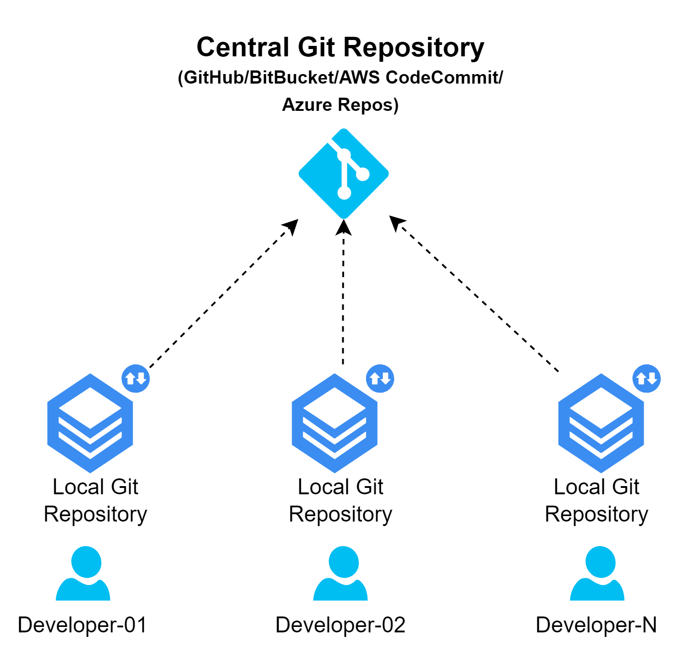

# Introducing GitHub

## 01. What is GitHub?

- _GitHub_ is a developer platform that allows developers to create, store, manage and share their code.
- It uses _Git_ software, providing the distributed version control of Git
- Git also provides many other important dev features for every project, like:
  1. Access control
  2. Bug tracking
  3. Software feature requests
  4. Task management
  5. Continuous integration
  6. Documentation

## XX. Create a new GitHub Account

- Visit https://github.com/ >> Click **Sign up** button

  - Email Address
  - Password
  - Username
  - Your Country/Region

- Once your GitHub account is created, sign-in to validate it.
  - Visit https://github.com/ >> Click **Sign in** button >> enter the credentials

## XX. GitHub Authentication mechanisms

- SSH
- HTTPS
- PAT

## XX. How to bring my application code on `GitHub`?

### `METHOD-01`: Start a new git project from scratch

- If you already have an existing local repository that you want to push to GitHub, kindly follow these steps:

  1. Create a new repository on GitHub

  2. Connect your local repo to GitHub repo (remote)
  3. Push the changes to GitHub

### `METHOD-02`: Existing Repository

## XX. Cloning Non-Github repo

## XX. Pushing changes to GitHub

## Hands-on Excercises - GitHub Basics
